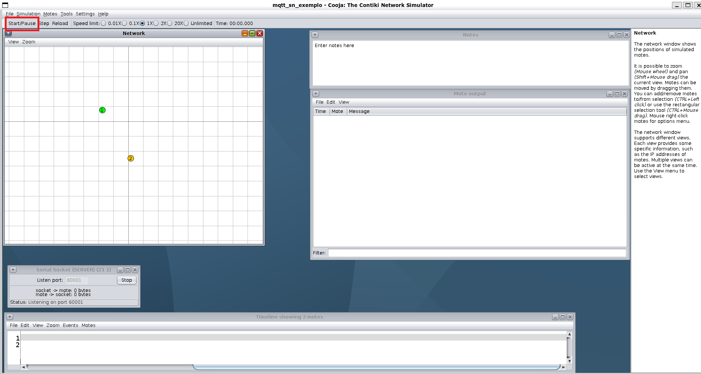

# Simulando a comunicação entre um cliente e um broker MQTT-SN no Cooja

## Pré-requisitos

```
sudo apt update && sudo apt install -y unzip git make gcc mosquitto-clients default-jdk ant
```

```
update-alternatives --config java
```

## 1. Download do Contiki-NG 

No diretório home de seu usuário, clone o repositório do Contiki-NG:

```bash
cd ; git clone https://github.com/contiki-ng/contiki-ng.git
```

```bash
cd ~/contiki-ng ; git submodule update --init --recursive
```

## 2. Download da implementação do MQTT-SN para Contiki

Dentro do repositório do Contiki-NG, clone o repositório do MQTT-SN:

```bash
cd ~/contiki-ng ; git clone https://github.com/aignacio/homestark_mqtt_6lowpan_port.git
```

Renomeie o repositório do MQTT-SN:

```bash
mv homestark_mqtt_6lowpan_port MQTT-SN-Contiki---HomeStark
```

## 3. Compilação do tunslip6

Dentro da pasta onde está o código fonte do tunslip6, compile-o:

```bash
cd ~/contiki-ng/tools/serial-io ; make
```

## 4. Modificação do arquivo de inicialização do tunslip6

Modifique o script de inicialização do tunslip6 para que utilize `sudo` e também para que acesse a pasta atual do tunslip6:

```bash
cd ~/contiki-ng/MQTT-SN-Contiki---HomeStark/scripts_aux ; echo -e '#!'"/bin/bash\nsudo $HOME/contiki-ng/tools/serial-io/tunslip6 -a 127.0.0.1 aaaa::1/64\n" > webserver_slip.sh ; chmod +x webserver_slip.sh
```

## 5. Descompactação do broker MQTT-SN

Na pasta de ferramentas do MQTT-SN, descompacte o broker:

```bash
cd ~/contiki-ng/MQTT-SN-Contiki---HomeStark/tools ; unzip mosquitto.rsmb.zip
```

## 6. Executando a simulação

Abra um novo terminal e execute o broker MQTT-SN nele:

```bash
cd ~/contiki-ng/MQTT-SN-Contiki---HomeStark/tools/mosquitto.rsmb/rsmb/src ; ./broker_mqtts config.mqtt
```

Abra mais um novo terminal e execute um cliente MQTT-SN para receber todas as mensagens que chegarem ao broker:

```bash
mosquitto_sub -t "#" -v -i teste
```

Abra outro novo terminal e execute o Cooja:

```bash
cd ~/contiki-ng/tools/cooja ; ./gradlew run
```

Na tela inicial do Cooja, clique em `File->Open Simulation->Browse..`. para buscar por uma simulação:


Na janela que abrir, clique em `Home` (figura da casa) e depois entre na pasta `contiki-ng`:


Agora entre na pasta `MQTT-SN-Contiki---HomeStark`:


Entre na pasta `simulacoes`:


Dê dois cliques sobre o arquivo `mqtt_slip_br.csc`:


Será aberta uma janela de configuração da simulação. Nessa janela, clique em `create`:


*__OBS__*: Se aparecerem outras janelas de configuração, apenas selecione **OK** para todas.

A simulação irá abrir. Inicie a simulação clicando em `Start/Pause`:



## 7. Tunelamento entre broker simulado e broker real

Abra um novo terminal e crie um tunelamento entre o broker do Cooja e o da máquina real utilizando o script de inicialização do tunslip6:

```bash
cd ~/contiki-ng/MQTT-SN-Contiki---HomeStark/scripts_aux ./webserver_slip.sh
```

## 8. Observe os terminais do broker e do cliente anteriormente inicializados

Terminal do cliente:


Terminal do broker:


