# Criando um cliente MQTT-SN no Cooja

O MQTT-SN é uma adaptação do protocolo MQTT para redes de sensores sem fio de baixa potência. Este tutorial irá demonstrar a criação de um mote cliente MQTT-SN no Cooja. 

## 1. Pré-requisitos

Para esse tutorial, será necessário ter o `Cooja` instalado e configurado, juntamente com o repositório do `Contiki-NG`. Caso ainda não tenha, um tutorial para realizar essa instalação é disponibilizado neste [link](https://github.com/Kyoto-01/tutoriais-tech/blob/main/executando-o-cooja-em-um-container-docker/index.md).

## 2. Download do código do cliente MQTT-SN

* Em sua máquina, vá até o diretório do Contiki-NG e clone o repositório do projeto `mqtt-sn-contiki-ng`:

```bash
git clone https://github.com/Kyoto-01/mqtt-sn-contiki-ng.git
```

## 3. Criação do cliente MQTT-SN no Cooja

Inicie o Cooja e execute os seguintes passos:

* Vá em `File->New simulation...` e inicie a criação de uma nova simulação:

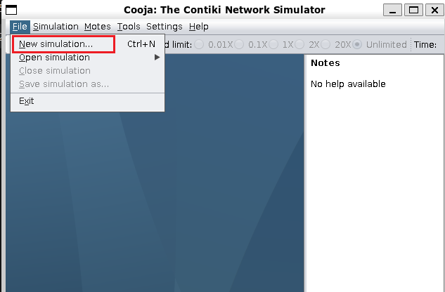

* Atribua um nome para a simulação em `Simulation name` e crie a simulação clicando no botão `create`:

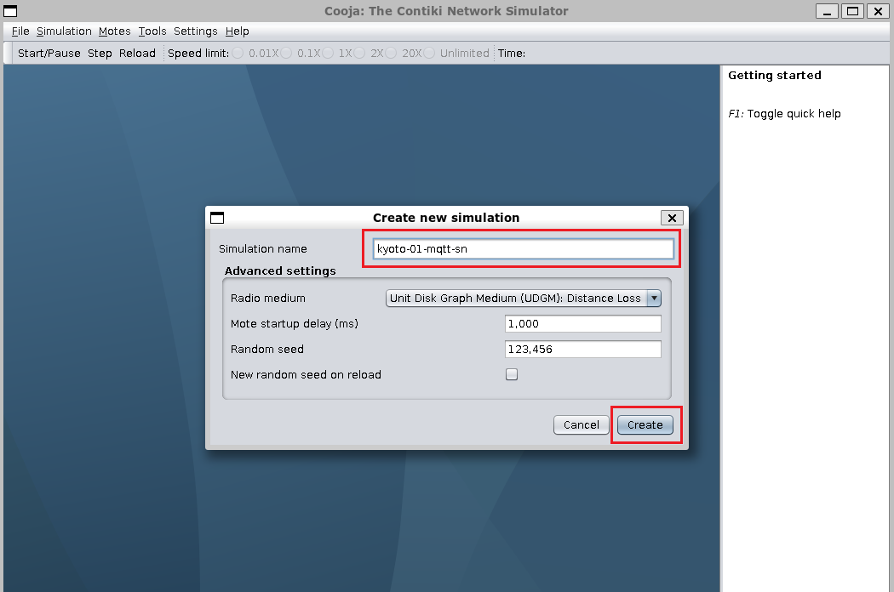

* Agora que a simulação está criada, já podemos adicionar um mote para executar o nosso cliente MQTT-SN. Para isso, vá em `Motes->Add motes->Create new mote type->Sky mote...` :

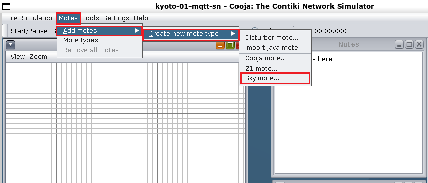

* Opcionalmente, dê um nome para o mote em `Description` e depois clique no botão `Browse` para selecionar o firmware do cliente MQTT-SN:

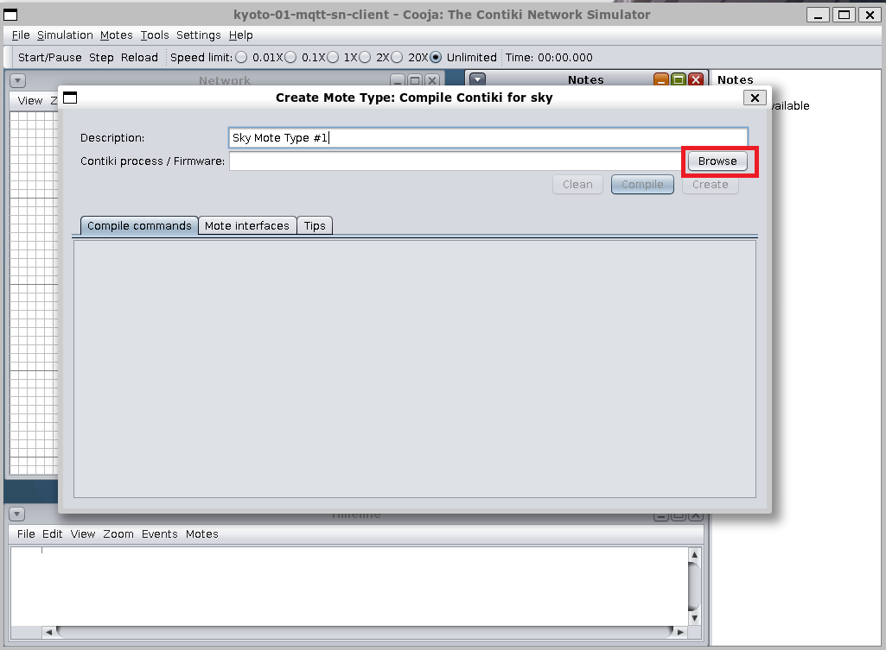

* Vá em `Look in` e entre no diretório onde o Contiki-NG está instalado:

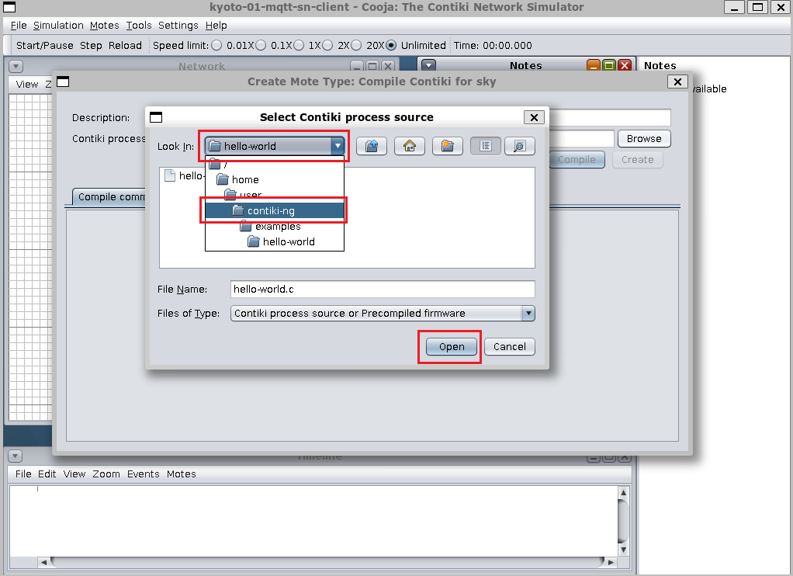

* Dentro do diretório do Contiki-NG, entre no diretório do projeto `mqtt-sn-contiki-ng`:

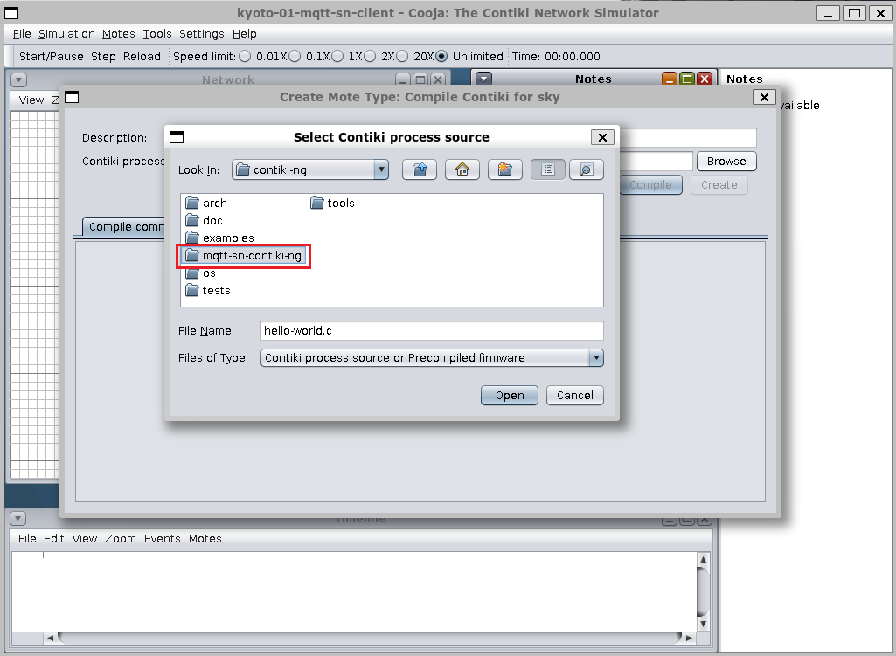

* Dentro do diretório do `mqtt-sn-contiki-ng`, selecione o arquivo `main_core.c`:

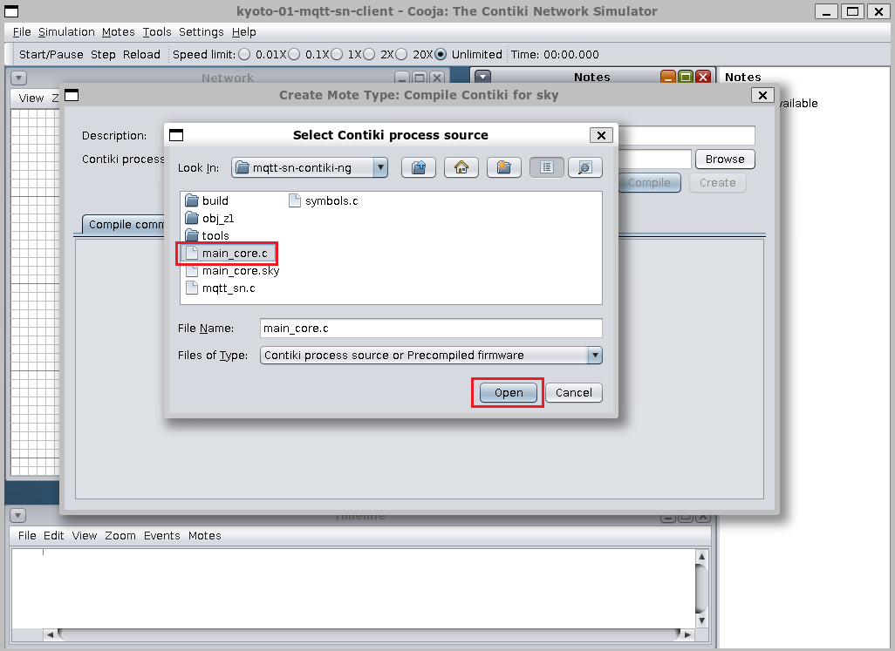

* Clique no botão `Compile` para realizar a compilação do código contido em `main_core.c`:

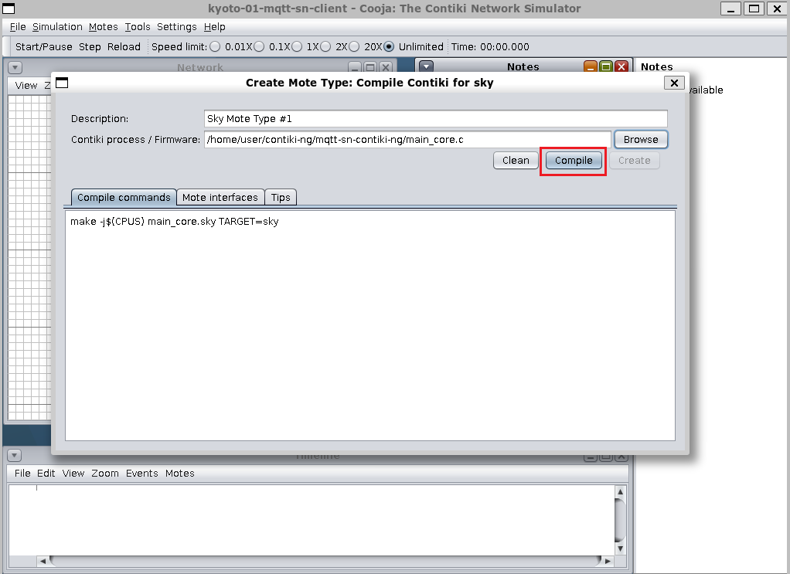

* Quando a compilação terminar, ou seja, quando a mensagem "make: 'main_core.sky' is up to date." aparecer, clique no botão `Create` para criar o mote:

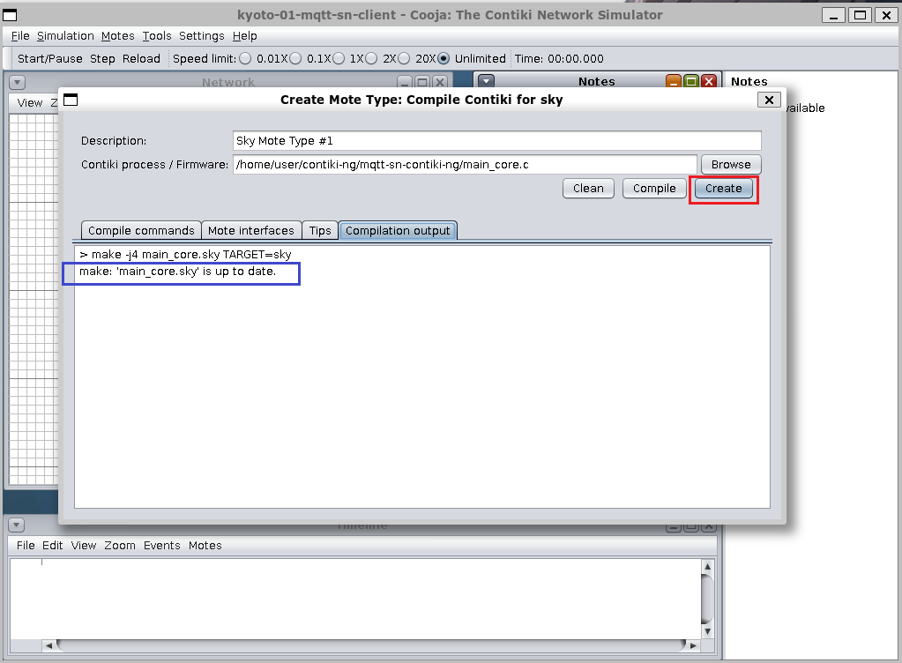

* Em `Number of new motes` você pode ajustar o número de motes que serão adicionados à simulação, porém, para este tutorial, adicionaremos apenas um. Clique em `Add motes` para adicionar o mote criado:

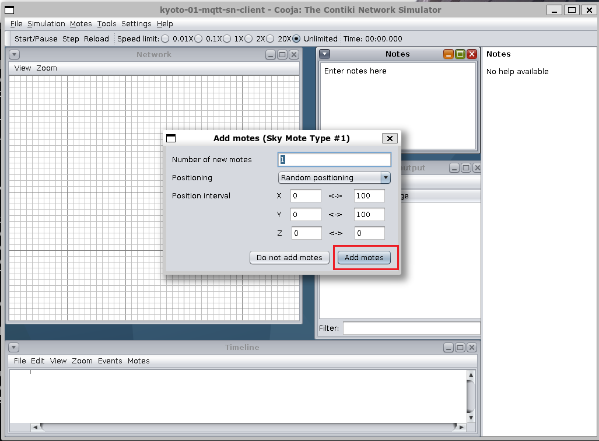

* Com o mote cliente MQTT-SN criado, você já pode começar a realizar as suas simulações:

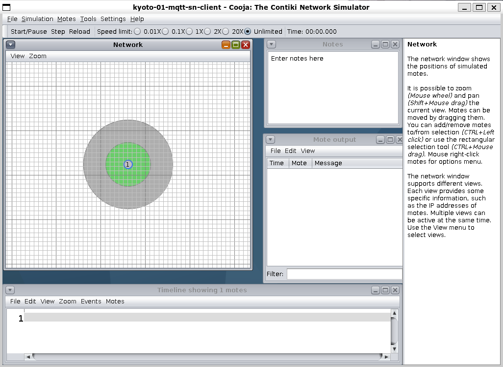
