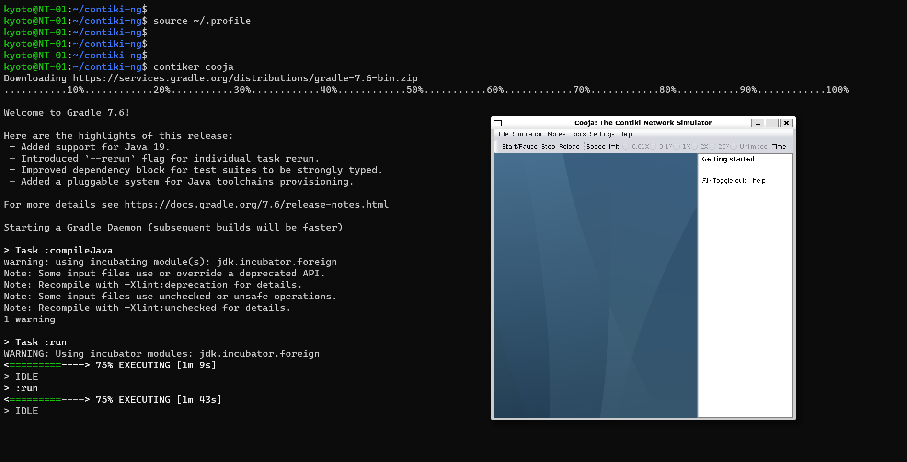

# Executando o Cooja em um container Docker

O Cooja é um simulador de redes de sensores sem fio cujos dispositivos utilizam o Contiki-NG como sistema operacional. O Cooja já vem instalado no Contiki-NG, necessitando apenas de algumas configurações para rodar. Este tutorial apresenta uma forma simples de executar o Cooja, apenas utilizando um ambiente virtualizado e com todas as dependências satisfeitas.

## 1. Pré-requisitos

Para esse tutorial, é necessário ter o `Git` e o `Docker` instalados em sua máquina `Linux`. Os passos a seguir irão te guiar na instalação desses pré-requisitos.

### 1.1. Atualização do repositório de pacotes

```bash
sudo apt update
```

### 1.2. Instalação do Git

```bash
sudo apt install -y git
```

### 1.3. Instalação do Docker

A instalação do Docker pode variar dependendo da distribuição Linux que se está utilizando. Os passos a seguir demonstram a instalação do Docker em um ambiente `Ubuntu`. No entanto, o passo a passo para a instalação do Docker nas demais distribuições Linux pode ser encontrado [aqui](https://docs.docker.com/engine/install/).

* Instale as dependências do Docker:

```bash
sudo apt install -y ca-certificates curl gnupg
```

* Adicione a chave do repositório do Docker:

```bash
sudo install -m 0755 -d /etc/apt/keyrings
```

```bash
curl -fsSL https://download.docker.com/linux/ubuntu/gpg | sudo gpg --dearmor -o /etc/apt/keyrings/docker.gpg
```

```bash
sudo chmod a+r /etc/apt/keyrings/docker.gpg
```

* Adicione o repositório do Docker na lista de repositórios:

```bash
echo "deb [arch="$(dpkg --print-architecture)" signed-by=/etc/apt/keyrings/docker.gpg] https://download.docker.com/linux/ubuntu "$(. /etc/os-release && echo "$VERSION_CODENAME")" stable" | sudo tee /etc/apt/sources.list.d/docker.list > /dev/null
```

* Instale a versão mais atual do Docker:

```bash
sudo apt update
```

```bash
sudo apt install -y docker-ce docker-ce-cli containerd.io docker-buildx-plugin docker-compose-plugin
```

* Dê permissão para que o usuário atual possa executar o Docker:

```bash
sudo usermod -aG docker $USER
```

## 2. Baixando e executando o container Docker do Contiki-NG e o Cooja

Agora que temos o Git e o Docker instalados, já podemos baixar e executar o container do Contiki-NG, que fornece um ambiente pronto para a execução do Cooja.

* Faça download da imagem do container do Contiki-NG:

```bash
docker pull contiker/contiki-ng
```

* Faça download do repositório do Contiki-NG:

```bash
cd ~
```

```bash
git clone https://github.com/contiki-ng/contiki-ng.git
```

```bash
cd contiki-ng
```

```bash
git submodule update --init --recursive

```

* Crie um alias para a criação do container do Contiki-NG:

```bash
echo 'export CNG_PATH=/home/$USER/contiki-ng' >> ~/.profile
```

```bash
echo 'alias contiker="docker run --privileged --sysctl net.ipv6.conf.all.disable_ipv6=0 --mount type=bind,source=$CNG_PATH,destination=/home/user/contiki-ng -e DISPLAY=$DISPLAY -e LOCAL_UID=$(id -u $USER) -e LOCAL_GID=$(id -g $USER) -v /tmp/.X11-unix:/tmp/.X11-unix -v /dev/bus/usb:/dev/bus/usb -ti contiker/contiki-ng"' >> ~/.profile
```

```bash
source ~/.profile
```

* Execute o Cooja :

```bash
contiker cooja
```

Após algum tempo de carregamento, a tela inicial do Cooja deve ser aberta e você já pode criar as suas simulações. A tela se assemelha com a seguinte:



## 3. Fontes

* [Instalação do Docker no Ubuntu](https://docs.docker.com/engine/install/ubuntu/)
* [Execução do Contiki-NG em um container Docker](https://docs.contiki-ng.org/en/develop/doc/getting-started/Docker.html)
